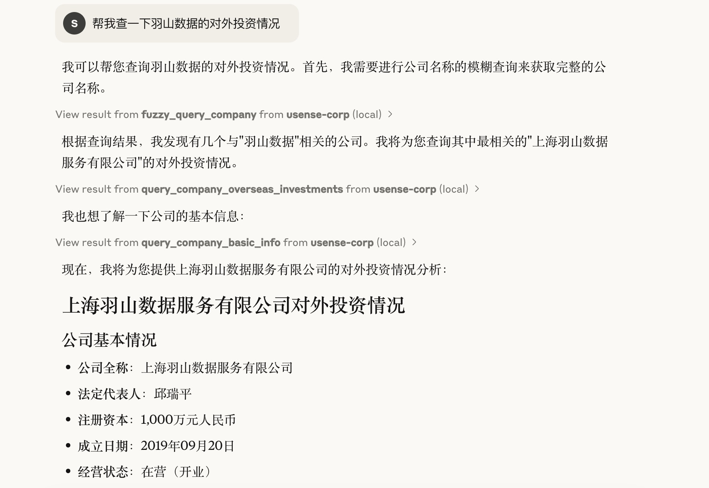
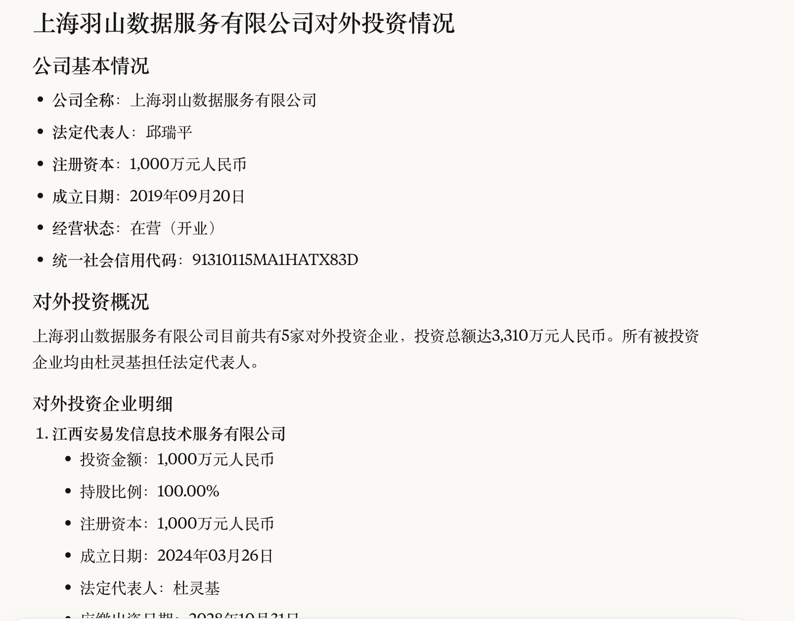
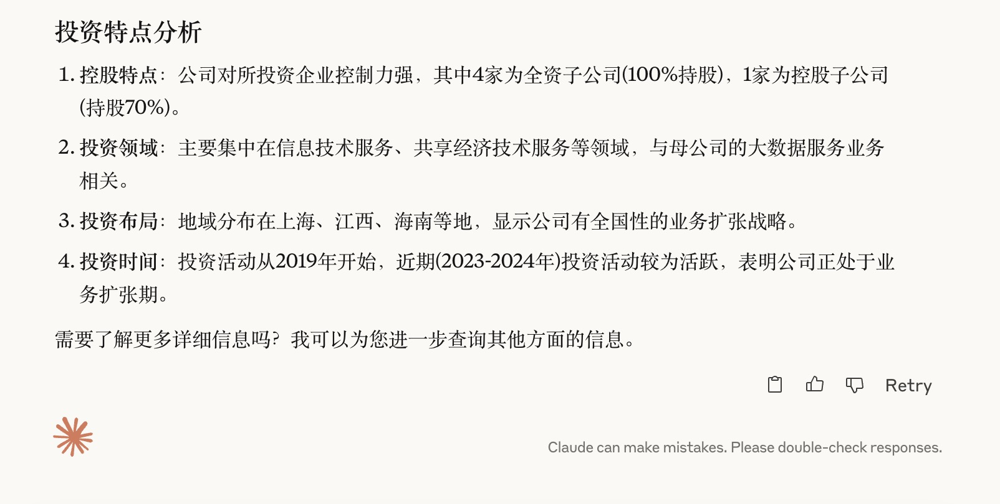
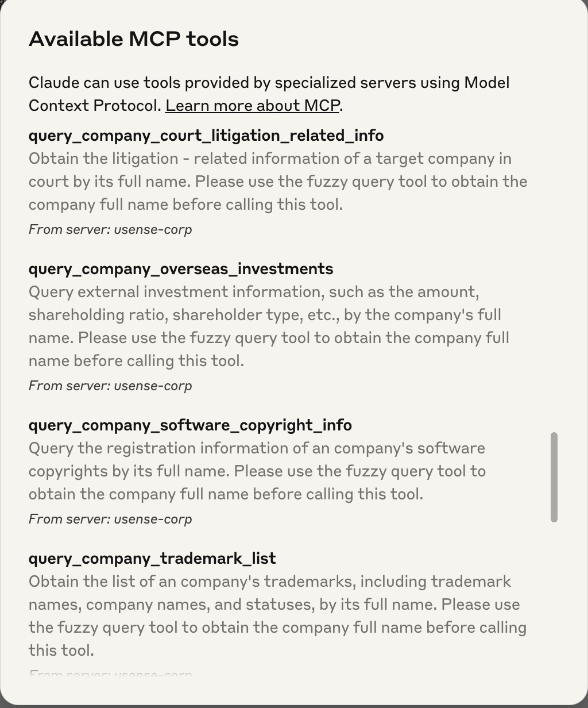

## 简介
羽山数据API服务现已全面兼容MCP协议，打造数据服务MCP Server。usensedata-mcp-server-query-china-company项目为企业类数据查询服务server，用户可通过简单配置快速通过LLM使用羽山数据企业类数据服务。依赖MCP Typescript SDK，可在支持MCP协议的智能体助手中快速接入。

## 工具列表

### 1. `verify_company_name_and_president`
**简介**：验证法人姓名与企业名称是否一致。返回 0 表示一致，返回 1 表示不一致。  
**入参**：
- `operName`：代表人姓名
- `entName`：公司全名

---

### 2. `fuzzy_query_company`
**简介**：通过企业名称关键词模糊查询公司信息。  
**入参**：
- `keyWord`：公司名称关键词

---

### 3. `query_company_basic_info`
**简介**：根据公司全名查询企业基本信息（如法人、注册资本、统一社会信用代码等）。  
**入参**：
- `entname`：公司全名

---

### 4. `query_company_overseas_investments`
**简介**：查询企业的对外投资信息，如投资金额、持股比例、股东类型等。  
**入参**：
- `entName`：公司全名

---

### 5. `query_company_change_records`
**简介**：根据公司全名查询企业变更记录内容。  
**入参**：
- `entName`：公司全名

---

### 6. `query_company_software_copyright_info`
**简介**：根据公司全名查询其软件著作权登记信息。  
**入参**：
- `entName`：公司全名

---

### 7. `query_company_trademark_list`
**简介**：查询企业商标列表信息，包括商标名称、企业名称和状态。  
**入参**：
- `entName`：公司全名

---

### 8. `query_company_court_litigation_related_info`
**简介**：查询公司法院相关的诉讼信息。  
**入参**：
- `name`：公司全名

---

### 9. `query_company_abnormal_business_operation`
**简介**：根据公司全名查询企业的经营异常信息。  
**入参**：
- `keyWord`：公司全名

## 环境

### 获取Usense UserID和Key
请联系[羽山数据](https://www.yushanshuju.com/)获取用户账号与密钥

### 安装node.js
当在终端中能成功获取版本号即安装成功，mac须用brew安装
```
node -v
npm -v
```

### 安装依赖
```
npm install
```

### typescript打包
```
npm run build
```

### 更新版本
先登录npm账号，须在package.json中更新版本号
```
npm login
npm publish --access public
```

### 配置mcp server config
macos/linux
```
"mcpServers": {
  "usense-corp": {
    "command": "npx",
    "args": [
      "-y",
      "usensedata-mcp-server-query-china-company"
    ],
    "env": {
      "USENSEDATA_API_KEY": "your_api_key",
      "USENSEDATA_API_USERID": "your_api_userid"
    }
  }
}
```
windows
```
"mcpServers": {
  "usense-corp": {
    "command": "cmd",
    "args": [
      "/c",
      "npx",
      "-y",
      "usensedata-mcp-server-query-china-company"
    ],
    "env": {
      "USENSEDATA_API_KEY": "your_api_key",
      "USENSEDATA_API_USERID": "your_api_userid"
    }
  }
}
```
#### 效果
实际用户请求：***“帮我查一下羽山数据的对外投资情况”***



## 说明
1.获取实际请求中的需要查询的企业名称 “羽山数据”

2.调用企业模糊查询 [fuzzy_query_of_enterprises] 获取到跟 “羽山数据” 相关的企业列表信息，并从中取得到公司全名.

3.然后调用公司对外投资查询 [query_company_overseas_investments] 获取公司对应的投资信息.

4.再调用企业基本信息查询 [query_basic_enterprise_information] 获取公司的基本信息内容.

5.最后整理以上所以信息，进行输出返回最终展示结果信息.

#### Agent结果




#### MCP tools加载

